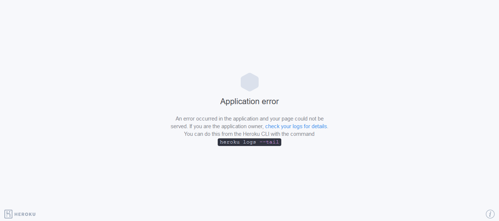

# Restaurant Review's Sentiment Analysis - Deployment
  

• This repository consists of files required to deploy a ___Machine Learning Web App___ created with ___Flask___.

• If you are searching for __Code__, __Algorithms used__ and __Accuracy__ of the model.. you won't find it here. Click the link mentioned below for the same: 
Link: (https://github.com/19karim/Sentiment-Analysis-Restaurant-Review)

• Please do ⭐ the repository, if it helped you in anyway.

_**----- Important Note -----**_ 
• If you encounter this webapp as shown in the picture given below, it is occuring just because **free dynos for this particular month provided by Heroku have been completely used.** _You can access the webpage on 1st of the next month._ 
• Sorry for the inconvenience.

